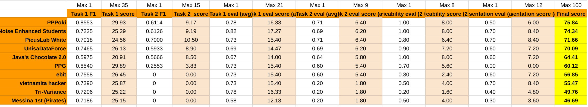

# Noise Enhanced Students - ITADATAhack 2024

## Overview

Welcome to the repository of **Noise Enhanced Students**, 
the team that participated in **ITADATAhack 2024**. 
This repository contains the solution to the challenge 
"Predicting Customer Creditworthiness", where we aimed 
to predict whether bank customers would repay their debt 
based on historical data. We secured **second place** in 
the competition!

### Team Members:
- **[Gabriele La Milia](https://www.linkedin.com/in/gabrielelm/)**  
- **[Gabriele Lo Cascio](www.linkedin.com/in/gabriele-locascio)**
- **[Simone Salvatore La Milia](https://www.linkedin.com/in/simonesalvatorelamilia/)**

## Challenge Description

The challenge required participants to build a machine learning model capable of predicting customer creditworthiness using a rich dataset of bank customers collected over five years, with data recorded quarterly.

## Quick PDF Presentation
[Click to open](./files/PRESENTAZIONE-NOISE_ENHANCED%20STUDENTS.pdf)

## Our Pitch At The Event

[Picth](https://www.linkedin.com/events/7241191022246940673/comments/) Jump to **56:54** for the key segment.

### Dataset
The dataset consisted of multiple features related to customer banking activity, including:
- **Product usage data** (e.g., product1, product2, ..., product17)
- **Transaction data** (wire transfers, securities bought/sold, counter transactions)
- **Account status** (balance, whether the customer left/joined the bank)
- **Label**: A boolean field indicating whether the customer repays their debt (`repays_debt`).

We were tasked with:
1. Building a predictive model to determine if a customer is likely to repay their debt (binary classification).
2. Predicting missing values for the last period in a separate test set using reduced knowledge from previous periods.

More information about the challenge can be found in the official documents:

- [Task1 Description](./files/Task01_ITADATAhack2024.pdf)
- [Task2 Description](./files/Task02_ITADATAhack2024.pdf)
- [Challenge Regulations](./files/Regolamento_ITADATAhack2024.pdf)

## Project Structure

- `notebooks/`
  - `NES.ipynb`: Contains the Jupyter Notebooks used during the competition.
  - `NES.py`: Same but converted into py
- `images/`: Support files.

